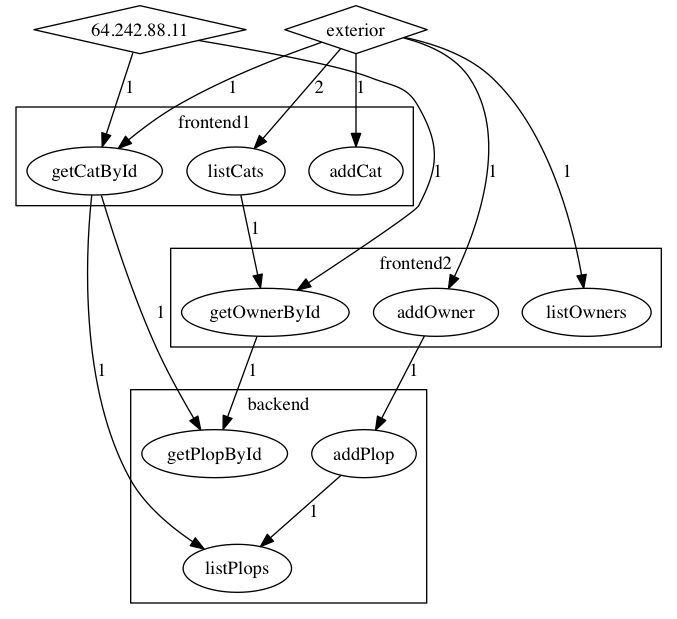

# Service dependencies: a proof of concept to extract dependencies between services from server logs

## The idea

When you have a system with many applications and services, knowing who call who is really handy :
- you can do impact analysis before doing a breaking change
- you can identify strange patterns in your dependencies that needs a refactoring
- …

Unfortunately this information is rarely available, and when some data exist, they often lack crucial details and are wrong or outdated:
- Some companies use [application portfolio management](https://en.wikipedia.org/wiki/Application_portfolio_management) solutions to store dependencies between applications. As the information is filled manually the data is never good enough to be usable.
- Security rules that limit links between applications will tell you what services are available to each applications, but they are often coarse-grained (by the application or by group of services) and outdated (unused links are almost never retired).

The best way to have complete and up to date data is to look at what is really happening on the servers.

How to do this? The basic plan is simple:
- feed the access logs of all servers to an application;
- parse the logs;
- analyze them to reconstruct the services call chains;
- make these info available.

Even if the idea is simple, the implementation is often seen as something horrendously complicated. The idea behind this project is to show how easy it really is, and to provide some code sample to build your own version suited for your custom needs.

## Prerequisites

- To identify the calling chains, you need a correlation IDs that are propagated through services, often set as an HTTP header
- To identify the calling applications, each service call should contain the name of the calling application. If it's not available you can try using the caller IP address: it's a bit hackish but it can work as a starting point.

## How to recreate the service call chains ?

The algorithm is simple:
- when parsing the logs for an application, for each record we extract the correlation id and the name of the calling application;
- we check in the existing calls of the calling application if there's one with the same correlation id;
- if we find one, we add a link to it in the original record.

Example if the call chain is A→B→C:
- we insert the A→B call,
- when processing the B→C call we check for a corresponding ?→B call

The provided implementation is simplistic because the logs can be provided in the other order (first B→C then A→B), but it doesn't fundamentally change the algorithm.

If we want to identify not only the calling application but the calling service, we must be able to identify a service from the URLs provided in the logs. For this we rely on Swagger declarations that declare the URL patterns for each service. Before uploading the log file for an application we must first upload its Swagger JSON file so it can map the log records to the services.

Result:

## Prerequisites for current implementation

- Java and Maven (the implementation use [Dropwizard](http://dropwizard.io) so can run it standalone or in a JEE server).
- The correlation id and calling application info should be in HTTP headers ( `X-CORRELATION-ID` and `X-SERVICE-ORIGIN` respectively ).
- Apache as web server, log format should be `%h %{X-SERVICE-ORIGIN}i %{X-CORRELATION-ID}i %t \"%r\" %>s` (see `net.archiloque.services_dependencies.logic.apachelog.ApacheLogParser` if you want to change it)
- PostgreSQL to store the data

## How to use the code

- Checkout the project
- Use `examples-data/reset_dabatase.sh` to create the database
- Run the server with `mvn install exec:java`
- Use `examples-data/push_example_data.sh` to push some data to the server
- Open your browser at [http://localhost:8080/](http://localhost:8080/)

## Current limitation

- Only Apache logs
- Only support REST and Swagger declarations
- Logs can only be pushed using HTTP
- Algo is limited and doesn't scale

## Useful libs

The project code is mostly glue around a few libs:
- [swagger-parser](https://github.com/swagger-api/swagger-parser) to parse the Swagger declaration.
- [Apache HTTPD logparser](https://github.com/nielsbasjes/logparser) to parse the Apache file.
- [graphviz-d3-renderer](https://github.com/mstefaniuk/graph-viz-d3-js) to create the dependencies graph in the browser.

## Possible next steps

- [ ] Extend to SOAP
- [ ] Extend to messages (JMS or other)
- [ ] Extend ways to push logs
- [ ] Improve the algorithm to make it scale
- [ ] Extend usages : create applications groups, error diagnostic
- [ ] …
